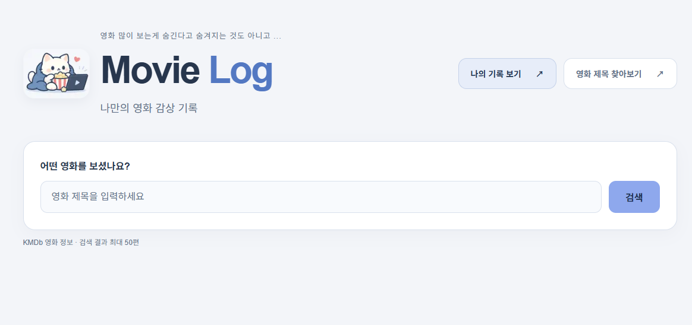
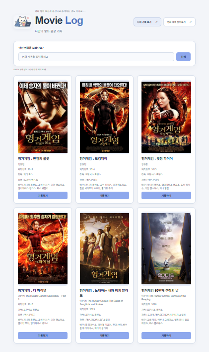
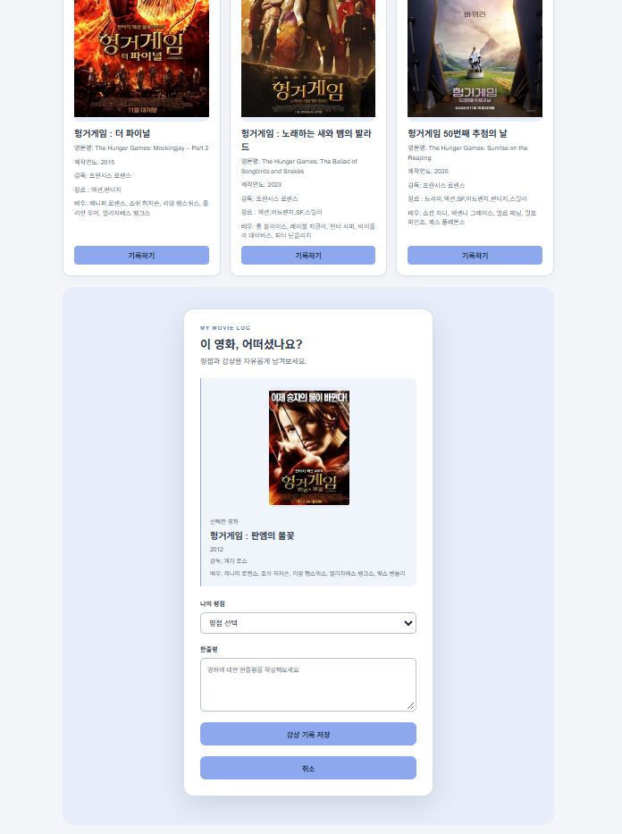
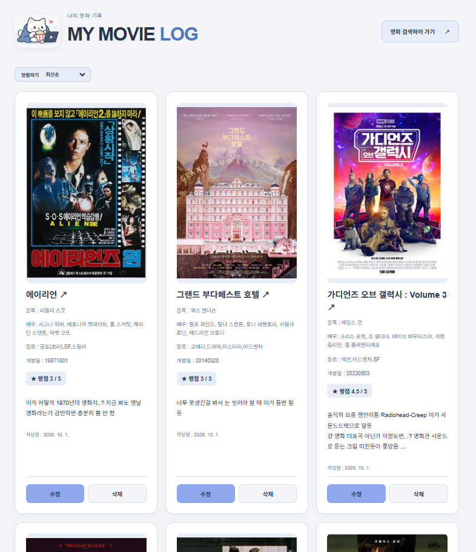

# Movie Log

## 1. 프로젝트 소개

**Movie Log**는 영화를 검색하고 평점과 한줄평을 남길 수 있는 Next.js 기반 영화 감상 기록 프로젝트입니다. KMDb에서 제공하는 영화 정보를 활용하여 감상한 작품을 찾고, 나만의 기록을 모아 볼 수 있습니다.

- **프로젝트 주제:** 영화 검색 및 개인 감상 기록 관리
- **제작 목적:** 영화를 보고 느낀 점을 영화 정보와 함께 저장하고, 나중에 다시 찾아볼 수 있도록 제작했습니다.
- **주요 사용자:** 감상한 영화의 평점과 감상을 한곳에 정리하고 싶은 사용자
- **개발 기간:** 2026.09.28 ~ 2026.10.01 

현재는 로그인 없이 로컬 JSON Server의 기록을 사용하는 개인용 프로젝트입니다.

## 2. 주요 기능

- **영화 검색:** 제목을 입력하여 KMDb 영화 정보를 검색할 수 있습니다.
- **영화 정보 확인:** 검색 결과에서 포스터, 영문명, 제작연도, 감독, 장르, 배우 정보를 확인할 수 있습니다.
- **감상 기록 등록:** 영화를 선택하고 0.5점 단위의 평점(0.5~5점)과 한줄평을 저장할 수 있습니다. 같은 작품 기록은 KMDb의 `DOCID`를 기준으로 중복 등록을 확인합니다.
- **감상 기록 조회:** 저장한 영화 정보와 평점, 한줄평, 작성일을 모아 볼 수 있습니다.
- **감상 기록 수정 및 삭제:** 기록 카드에서 평점과 한줄평을 수정하거나, 기록을 삭제할 수 있습니다.
- **기록 정렬:** 최신순, 평점 높은 순, 평점 낮은 순으로 기록을 정렬할 수 있습니다.
- **외부 영화 정보 연결:** 왓챠피디아에서 영화 제목을 찾아보거나, 기록한 영화의 제목을 눌러 관련 왓챠피디아 검색 결과로 이동할 수 있습니다.

| 화면 | 주소 | 설명 |
|---|---|---|
| 영화 검색 및 기록 작성 | `/` | 영화를 검색하고, 선택한 작품의 감상 기록을 작성합니다. |
| 나의 감상 기록 | `/reviews` | 저장한 기록을 조회·정렬·수정·삭제합니다. |

기록 작성 폼은 메인 화면 안에 표시되며, 별도의 상세 페이지나 등록 페이지는 없습니다.

## 3. 화면 구성

### 메인 화면



영화 제목을 입력하는 검색창, 나의 기록으로 이동하는 메뉴, 왓챠피디아 영화 검색 링크로 이동 버튼, 새로고침 등을 제공합니다.

### 검색 결과 화면



검색한 영화의 정보가 카드 형태로 표시됩니다. `기록하기` 버튼을 누르면 같은 페이지 아래로 스크롤 되고 평점과 한줄평을 입력하는 폼이 나타납니다.

### 감상 기록 작성 화면



선택한 영화의 정보 아래에서 평점과 한줄평을 입력합니다. 작성한 감상을 저장하거나 기록 작성을 취소할 수 있습니다.

### 나의 기록 화면



저장한 영화의 정보와 감상을 모아 보여 줍니다. 정렬 기준을 선택하거나 각 카드의 수정·삭제 버튼으로 기록을 관리할 수 있습니다. 또한 영화 검색 메인 페이지로 되돌아 갈 수도 있습니다.

## 4. 기술 스택

| 기술 | 사용 목적 |
|---|---|
| Next.js / App Router | 페이지 라우팅 및 KMDb 요청을 처리하는 서버 Route Handler |
| React  | 컴포넌트 구성 및 화면의 입력·선택 상태 관리 |
| JavaScript | 화면 동작과 데이터 처리 로직 작성 |
| CSS | 화면 레이아웃과 스타일 구현 |
| TanStack Query | 영화 검색 및 감상 기록의 서버 상태와 요청 상태 관리 |
| Fetch API | 영화 검색 및 감상 기록 API 호출 |
| JSON Server | `db.json`을 이용한 감상 기록 CRUD API 제공 |
| KMDb Open API | 영화 제목, 감독, 배우, 포스터 등의 정보 조회 |

## 5. 설치 및 실행 방법

### 실행 전 준비

- Node.js **22.12.0 이상**과 npm이 필요합니다. 현재 JSON Server 패키지의 Node.js 요구 버전을 기준으로 합니다.
- Git과 사용 가능한 **KMDb Open API 인증키**를 준비합니다.
- 영화 검색에는 인터넷 연결이 필요합니다.

### 1) 저장소 복제

```bash
git clone https://github.com/sxxminee/2026-SESAC-front-poject.git
```

### 2) 프로젝트 폴더로 이동

```bash
cd 2026-SESAC-front-poject
```

### 3) 패키지 설치

```bash
npm install
```

### 4) 환경변수 설정

프로젝트 최상위 경로(`package.json`과 같은 위치)에 `.env.local` 파일을 만들고, 발급받은 KMDb 인증키를 입력합니다.

```dotenv
KMDB_API_KEY=발급받은_KMDb_인증키
```

인증키는 `src/app/api/route.js`에서 서버 환경변수로 읽습니다. `.env.local`은 Git에서 제외되므로 저장소를 복제한 뒤 직접 생성해야 합니다. 환경변수를 변경했다면 Next.js 서버를 재시작합니다.

### 5) JSON Server 실행

첫 번째 터미널에서 실행합니다.

```bash
npm run server
```

`db.json`의 `reviews` 데이터를 사용하며, 기록 API 주소는 `http://localhost:4000/reviews`입니다. 등록·수정·삭제한 내용은 `db.json`에 반영되므로 서버를 다시 실행해도 유지됩니다. 저장소에 포함된 기존 기록이 처음부터 표시될 수 있습니다.

### 6) Next.js 실행

두 번째 터미널을 열고 같은 프로젝트 폴더에서 실행합니다.

```bash
npm run dev
```

두 서버가 모두 실행된 상태에서 브라우저로 접속합니다.

| 구분 | 주소 |
|---|---|
| 영화 검색 화면 | http://localhost:3000 |
| 나의 기록 화면 | http://localhost:3000/reviews |
| JSON Server | http://localhost:4000 |
| 감상 기록 API | http://localhost:4000/reviews |

현재 `package.json`의 주요 실행 명령은 다음과 같습니다.

```json
{
  "scripts": {
    "dev": "next dev",
    "build": "next build",
    "start": "next start",
    "lint": "eslint",
    "server": "json-server db.json --port 4000"
  }
}
```

배포용 빌드를 로컬에서 확인하려면 `npm run build` 이후 `npm run start`를 실행합니다. 이때도 기록 기능을 사용하려면 JSON Server를 별도로 실행해야 합니다.

### 실행 중 문제가 생긴 경우

- **`KMDB_API_KEY 설정이 필요합니다.`:** `.env.local`의 위치와 변수명을 확인한 뒤 Next.js 서버를 재시작합니다.
- **KMDb 인증 또는 요청 오류:** 인증키의 값과 승인 상태를 확인합니다.
- **감상 기록을 불러오지 못하는 경우:** JSON Server가 4000번 포트에서 실행 중인지 확인합니다.
- **포트가 이미 사용 중인 경우:** 기존 서버의 실행 상태를 확인합니다. 기록 API 주소는 `src/app/api/reviewApi.js`에 `http://localhost:4000/reviews`로 지정되어 있으므로, JSON Server의 포트를 바꾸면 해당 주소도 함께 수정해야 합니다.

## 6. 폴더 구조

```text
movie-diary/
├─ public/
│  └─ img/                   # 로고 이미지
├─ src/
│  ├─ app/
│  │  ├─ api/
│  │  │  ├─ route.js         # GET /api: KMDb 검색 요청 처리
│  │  │  ├─ movieApi.js      # 영화 검색 요청 및 응답 목록 추출
│  │  │  └─ reviewApi.js     # 감상 기록 조회·등록·수정·삭제 요청
│  │  ├─ reviews/
│  │  │  └─ page.js          # 감상 기록 목록·정렬·수정·삭제 화면
│  │  ├─ Providers.js        # TanStack Query 공통 Provider
│  │  ├─ layout.js           # 공통 레이아웃
│  │  ├─ page.js             # 영화 검색 메인 화면
│  │  └─ globals.css         # 공통 스타일
│  └─ components/
│     ├─ MovieSearch.js      # 영화 검색 및 작품 선택
│     ├─ ReviewForm.js       # 평점·한줄평 작성 폼
│     └─ MoviePoster.js      # 영화 포스터 및 대체 문구
├─ db.json                   # 감상 기록 저장 데이터
├─ .env.local                # KMDb 인증키
├─ package.json              # 패키지 및 실행 명령
└─ README.md
```


## 7. 컴포넌트 설계 및 상태 관리

### 주요 컴포넌트

| 컴포넌트 | 역할 |
|---|---|
| `Home Page` | 메인 화면의 로고, 이동 메뉴, 영화 검색 영역을 배치합니다. |
| `MovieSearch` | 검색어를 입력받아 영화 목록을 표시하고, 선택한 영화의 작성 폼을 엽니다. |
| `ReviewForm` | 평점과 한줄평을 검증하고, 중복 기록 확인 후 감상 기록을 저장합니다. |
| `MoviePoster` | 여러 화면에서 포스터를 표시하고, 주소가 없거나 이미지 로딩이 실패하면 대체 문구를 보여 줍니다. |
| `Reviews Page` | 저장한 기록을 표시하고 정렬, 수정, 삭제 기능을 제공합니다. |
| `Providers` | 공통 `QueryClient`를 생성하고 하위 컴포넌트에 제공합니다. |

검색과 기록 작성은 입력값과 동작이 달라 별도 컴포넌트로 분리했습니다. <br>
포스터 표시는 검색 결과, 작성 폼, 기록 목록에서 반복되므로 `MoviePoster`로 공통화했습니다. <br>

### 상태 관리

- **검색 입력 및 선택 상태:** `MovieSearch`의 `useState`로 입력 중인 검색어, 제출한 검색어, 선택한 영화를 관리합니다. 입력값과 실제 검색 기준을 분리하여 검색 버튼을 누른 시점의 결과를 표시합니다.
- **영화 검색 결과:** TanStack Query의 `["movies", 검색어]` 키로 관리합니다. 입력할 때마다 요청하지 않고 검색을 제출할 때 `fetchQuery`를 실행합니다.
- **감상 기록 목록:** `["reviews"]` 키의 `useQuery`로 조회합니다. 등록·수정·삭제는 `useMutation`으로 처리하고, 성공하면 `invalidateQueries`로 목록을 갱신할 수 있도록 합니다.
- **작성 및 수정 상태:** 평점과 한줄평은 해당 폼에서 관리하고, 수정 중인 기록 ID와 정렬 기준은 `ReviewsPage`에서 관리합니다. 각 화면에서만 필요한 UI 상태이므로 로컬 상태로 둡니다.
- **데이터 보관:** TanStack Query는 서버 데이터의 캐시와 요청 상태를 담당하고, 기록의 실제 저장은 JSON Server와 `db.json`이 담당합니다.

### 데이터 흐름

```text
영화 검색: 브라우저 → movieApi.js → GET /api → KMDb Open API
기록 관리: 브라우저 → reviewApi.js → JSON Server → db.json
```

## 8. 트러블슈팅

> 아래 내용은 현재 코드에 구현된 문제 대응 방식을 기준으로 정리했습니다.


### 포스터가 없거나 불러오지 못하는 문제

**문제**

일부 영화는 포스터 정보가 없거나 이미지 로딩에 실패할 수 있습니다.

**원인**

KMDb의 모든 영화에 포스터가 등록되어 있는 것은 아니며, 외부 이미지 주소가 있어도 실제 요청이 실패할 수 있습니다.

**해결**

`MoviePoster`에서 HTTP/HTTPS 주소인지 확인하고, 이미지의 `onError` 이벤트로 실패한 주소를 기록합니다. 유효한 주소가 없거나 로딩이 실패하면 `포스터 정보 없음`을 표시합니다.

**알게 된 점**

데이터가 존재하는지 확인하는 것과 실제 리소스를 불러올 수 있는지 확인하는 것은 별개의 처리입니다. 반복되는 예외 처리를 공통 컴포넌트에 모으면 화면마다 같은 기준을 적용할 수 있습니다.

## 9. 프로젝트 회고


영화 검색부터 감상 기록 작성과 관리까지 이어지는 흐름을 구현하면서, 필요한 기능을 화면과 컴포넌트 단위로 나누는 과정의 중요성을 배웠습니다. 특히 검색 결과에서 선택한 영화 정보를 작성 폼으로 전달하는 과정에서 컴포넌트의 역할과 데이터 흐름을 구체적으로 이해할 수 있었습니다.

TanStack Query로 서버 데이터를 관리하면서 검색어·입력값 같은 화면 상태와 서버에서 가져오는 목록 상태를 구분하게 되었습니다. 

앞으로는 감상 기록의 검색과 관람 날짜 입력, 평점 별 모양으로 평가하는 기능을 추가하고 싶습니다.

